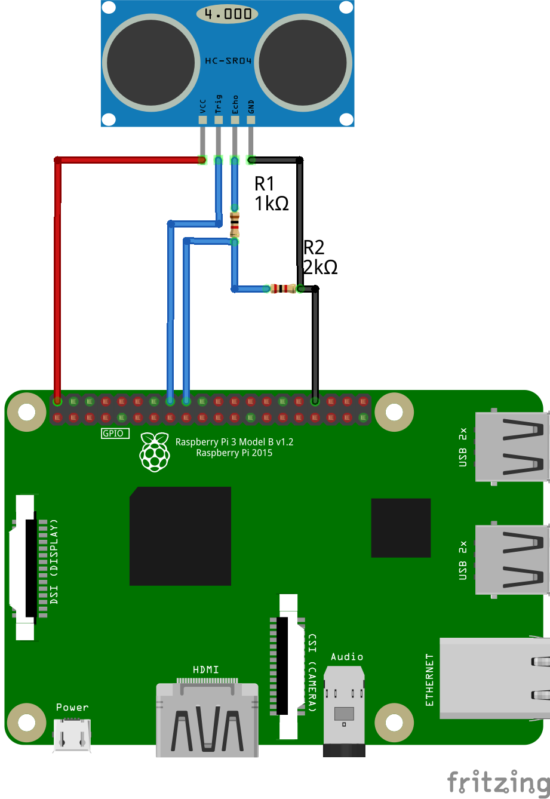
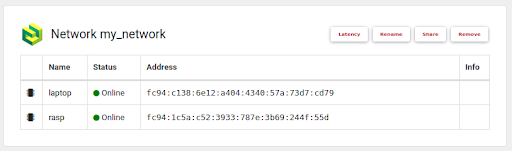
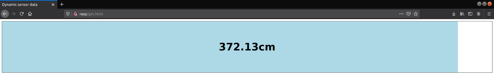

# Using Raspberry Pi as a web server with no static IP address.

No static IP? No problem. Step by step, we will set up a VPN, a web server and HC-SR04 ultrasound distance sensor on Raspberry Pi.

## Required hard- and software
- Raspberry Pi with Raspbian
- HC-SR04 ultrasonic distance sensor
- 3x 1kΩ Resistors (or 1x1kΩ 1x2kΩ)
- Cables
- Husarnet VPN
- Apache
- RPi.GPIO Python library
- jQuery (get a link to the jQuery CDN)

## Assembling the circuit


As you can see, we need to use some resistance to lower the voltage, as voltage higher than 3.3V might harm RPi and the sensor will not work correctly.


## Husarnet VPN

Our goal is to be able to read data from anywhere, so we will now need to set up the VPN. That solution is much safer, as we are not exposing the device to open internet traffic. 
I assume you have already created an account at https://husarnet.com/.
If so, let's create a network and add our devices.

1. Install Husarnet Client on the RPi as well as on another device (e.g. your computer) so that you can display the website later. To install the client, use the following command: 
    ```bash
    curl https://install.husarnet.com/install.sh | sudo bash
    ``` 
    After the installation process is completed, it is recommended to restart Husarnet:
    ```bash
    sudo systemctl restart husarnet
    ```

2. Log in at https://app.husarnet.com/, click **create a network** and upon successful completion of the process, in the network panel click **add an element**.  

3. After clicking it, a menu will pop up. As you can see, there are plenty of options that can be used to add a device to a network. The most universal of them is to use a *join code*. Copy it and proceed to the command line on RPi.
    ```bash
    sudo husarnet join <PASTE_YOUR_JOIN_CODE_HERE> <YOUR_DEVICE_NAME>
    ```
    It's a good idea to set device names that are easy to remember, as you can later use them instead of long, ugly IPv6 addresses.

4. Do the same for all other devices that you want to add to your network.

    A successfully configured network should be similar to this:
    
    
    You can now test if your network works by pinging the devices. 
    For example, on my *laptop* device I would run:
    ```bash
    ping6 -c 5 rasp
    ```
    to send 5 pings to *rasp*.

## Sensor software
Before we get started with writing code, we will need to install RPi.GPIO. This is very straightforward:
```bash
pip3 install RPi.GPIO
``` 

There are a lot of code samples available on the internet to be used with HC-SR04. 
In this example, we will use the following python3 program:
```python
import RPi.GPIO as GPIO
import time
GPIO.setmode(GPIO.BCM)

TRIG = 23
ECHO = 24

GPIO.setup(TRIG, GPIO.OUT)
GPIO.setup(ECHO, GPIO.IN)

file = '/var/www/html/data.txt' # we will save the distance to a text file

try:

    while True:
        GPIO.output(TRIG,False)
        time.sleep(2)
        GPIO.output(TRIG, True)
        time.sleep(0.00001)
        GPIO.output(TRIG, False)
    
        while GPIO.input(ECHO) == 0:
            pulse_start = time.time()

        while GPIO.input(ECHO) == 1:
            pulse_end = time.time()

        pulse_duration = pulse_end - pulse_start
        dist = pulse_duration * 17150
        dist = round(dist, 2)
        print("distance:", dist) # we don't need to print anything, just for convenience
        with open(file, 'w') as f:
            f.write(str(dist))

except KeyboardInterrupt:
    print("cleanup")
    GPIO.cleanup()
```

As you can see, we are simply saving the calculated distance inside of a .txt file located in Apache directory. This was by far the easiest way I could think of to access sensor data without having to write fancy backend services. 
To install and enable Apache on Raspberry Pi do the following:
```bash
sudo apt update
sudo apt install apache2 -y
``` 
After installation, you can restart Apache to make sure the service works fine:
```bash
sudo service apache2 restart
```
Execution of a command like
```bash
curl localhost
```
should result in getting the default Apache index.html page.

## Website
Now that we have a working interface to acquire data from, we can proceed to presenting it to a user. For that we will need jQuery and some basic CSS/JS. 

Let’s start by dynamically pulling data from the text file. Let’s say we will refresh the data once a second. 
```html
<script>
        var hostname = document.location.origin;
        var interval = 1000;

        function getData() {
            $.ajax({
                url: hostname+"/data.txt",
                type: "GET",
                dataType : "text",
                success: function(data){
                    
                    d = document.getElementById('sensor-data');
                    d.innerHTML = data;
                    bar.set_value(data);

                    setTimeout(function(){
                        getData();
                    }, interval);
                }
            });
        }

        getData();
</script>
```

We are using AJAX, which is a component of the jQuery library used for dynamic requests and refreshing data without having to reload the page. For now, don’t worry about the three lines starting from geElementById, we’ll get to that later. 
Our function getData simply makes a request to /data.txt, which is the directory with our sensor data. The setTimeout construct sets an interval defined earlier (1000ms), after which the entire function logic is repeated. 

Let’s now draw a progress bar. We will start by defining 3 divs.
```html
<div class="progress-bar">
    <div class="result" id ="sensor-data"></div>
    <div class = "progress-bar-fill"></div>
</div>
```

We will quickly style it, so that the data is nicely presented to the user.
```html
<style>
    .progress-bar{
        width: 100%;
        height: 200px;
        border: 1px solid black;
        position: relative;
    }

    .progress-bar-fill{
        height: 100%;
        background: lightblue;
        transition: width 0.5s;
    }

    .result{
        position: absolute;
        width: 100%;
        height: 100%;

        display: flex;
        align-items: center;
        justify-content: center;

        font-weight: bold;
        font-size: 40px;
        font-family: sans-serif;
    }
</style>
```

We will now need to write some Javascript code that will change the length of the progress-bar-fill div. Long story short we want to change the width  styling parameter (values from 0-100%). 
For that we will write a class called ProgressBar (inside the script tags of course). 
```js   
class ProgressBar{
    constructor(element, intial_value){
        this.value_elem = element.querySelector('.result');
        this.fill_elem = element.querySelector('.progress-bar-fill');
        
        this.set_value(intial_value);
    }

    set_value(new_value){
        this.value_scaled = new_value * 0.25; //100% of the bar is now 400cm, scaled for better visibility
        //0.25=100% * 1/400
        this.value = new_value;

        if (this.value_scaled < 0) {
            this.value_scaled = 0;
        }

        if (this.value_scaled > 100) {
            this.value_scaled = 100;
        }

        
        this.update();
    }

        update(){
            const percentage = this.value_scaled + '%';

            this.fill_elem.style.width = percentage;
            this.value_elem.textContent = this.value + 'cm';
        }
}

bar = new ProgressBar(document.querySelector('.progress-bar'), 200);
```

The constructor of this class takes the styled element (*progress-bar-fill* div) and initial progress bar value as arguments. Initial value doesn’t really matter as it will immediately get changed by our code. 
If you look closely, you will notice I have initialized an instance of the ProgressBar class (*bar*). This is the same variable that occurs in one of previous snippets (inside the *getData* function). 
Our class has two methods. The first one is set_value which scales the distance in cm to % (0-100). I chose to scale the values to 400cm being 100% but in theory you could go all the way up to 4000cm as this is the maximum range of HC-SR04.  The second method is update. This sets the actual width of our div.

And that’s it!
We can now test our website. All the HTML/JS snippets put together into one file are available on the repository (*get.html* file, remember to copy it to /var/www/html directory). 

On your RPi, run the python script reading sensor data. In the directory where your script is located run:
```bash
sudo python3 script.py
```
Now you can open the website on your computer - open a web browser and go to *http://your_device_name/get.html*. 
There we go!  

