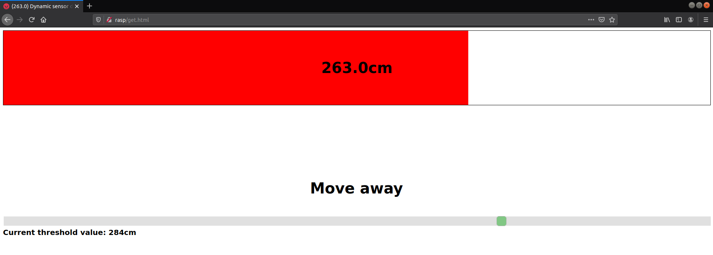

# Using Raspberry Pi as a web server with no static IP address.

No static IP? No problem. Step by step, we will set up a VPN, a web server and HC-SR04 ultrasound distance sensor on Raspberry Pi.

## Required hard- and software
- Raspberry Pi with Raspbian
- HC-SR04 ultrasonic distance sensor
- 3x 1kΩ Resistors (or 1x1kΩ 1x2kΩ)
- Cables
- Husarnet VPN
- Apache
- RPi.GPIO Python library
- jQuery (get a link to the jQuery CDN)

*I'm going through the installation of most of the software.*

## Assembling the circuit


As you can see, we need to use some resistance to lower the voltage, as voltage higher than 3.3V might harm RPi and the sensor will not work correctly.


## Husarnet VPN

Our goal is to be able to read data from anywhere, so we will now need to set up the VPN. That solution is much safer, as we are not exposing the device to open internet traffic. 
I assume you have already created an account at https://husarnet.com/.
If so, let's create a network and add our devices.

1. Install Husarnet Client on the RPi as well as on another device (e.g. your computer) so that you can display the website later. To install the client, use the following command: 
    ```bash
    curl https://install.husarnet.com/install.sh | sudo bash
    ``` 
    After the installation process is completed, it is recommended to restart Husarnet:
    ```bash
    sudo systemctl restart husarnet
    ```

2. Log in at https://app.husarnet.com/, click **create a network** and upon successful completion of the process, in the network panel click **add an element**.  

3. After clicking it, a menu will pop up. As you can see, there are plenty of options that can be used to add a device to a network. The most universal of them is to use a *join code*. Copy it and proceed to the command line on RPi.
    ```bash
    sudo husarnet join <PASTE_YOUR_JOIN_CODE_HERE> <YOUR_DEVICE_NAME>
    ```
    It's a good idea to set device names that are easy to remember, as you can later use them instead of long, ugly IPv6 addresses.

4. Do the same for all other devices that you want to add to your network.

    A successfully configured network should be similar to this:
    
    
    You can now test if your network works by pinging the devices. 
    For example, on my *laptop* device I would run:
    ```bash
    ping6 -c 5 rasp
    ```
    to send 5 pings to *rasp*.

## Sensor software
Before we get started with writing code, we will need to install RPi.GPIO. This is very straightforward:
```bash
pip3 install RPi.GPIO
``` 

There are a lot of code samples available on the internet to be used with HC-SR04. 
In this example, we will use the following python3 program:
```python
import RPi.GPIO as GPIO
import time
GPIO.setmode(GPIO.BCM)

TRIG = 23
ECHO =24

GPIO.setup(TRIG, GPIO.OUT)
GPIO.setup(ECHO, GPIO.IN)

file = '/var/www/html/data.txt'

try:

	while True:
		GPIO.output(TRIG,False)
		time.sleep(0.01)
		GPIO.output(TRIG, True)
		time.sleep(0.0001)
		GPIO.output(TRIG, False)
	
		while GPIO.input(ECHO) == 0:
			pulse_start = time.time()

		while GPIO.input(ECHO) == 1:
			pulse_end = time.time()

		pulse_duration = pulse_end - pulse_start
		dist = pulse_duration * 17150
		dist = round(dist, 2)
		
		print("distance:", dist, end='\r', flush=True)
		with open(file,'w') as f:
			f.write(str(dist))

except KeyboardInterrupt:
	print("cleanup")
	GPIO.cleanup()
```

As you can see, we are simply saving the calculated distance inside of a .txt file located in Apache directory. This was by far the easiest way I could think of to access sensor data without having to write fancy backend services. 
To install and enable Apache on Raspberry Pi do the following:
```bash
sudo apt update
sudo apt install apache2 -y
``` 
After installation, you can restart Apache to make sure the service works fine:
```bash
sudo service apache2 restart
```
Execution of a command like
```bash
curl localhost
```
should result in getting the default Apache index.html page.

## Website
Now that we have a working interface to acquire data from, we can proceed to presenting it to a user. For that we will need jQuery and some basic CSS/JS. 

### Retrieving sensor data
Let’s start by dynamically pulling data from the text file. Let’s say we will refresh the data once a second. 
```html
<script>
        var hostname = document.location.origin;
        var interval = 50; // you can adjust it depending on what refresh rate is sufficient for you

        function get_data() {
            $.ajax({
                url: hostname+"/data.txt",
                type: "GET",
                dataType : "text",
                success: function(data){
                    
                    d = document.getElementById('sensor-data');
                    d.innerHTML = data;
                    bar.set_value(data);

                    setTimeout(function(){
                        get_data();
                    }, interval);
                }
            });
        }

        get_data();
</script>
```

We are using AJAX, which is a component of the jQuery library used for dynamic requests and refreshing data without having to reload the page. For now, don’t worry about the three lines starting from geElementById, we’ll get to that later. 
Our function get_data simply makes a request to ```/data.txt```, which is the directory with our sensor data. The ```setTimeout``` construct sets an interval defined earlier (50ms), after which the entire function logic is repeated. 

### Displaying the data

Let’s now draw a progress bar. We will start by defining 3 divs.
```html
<div class="progress-bar">
    <div class="result" id ="sensor-data"></div>
    <div class = "progress-bar-fill"></div>
</div>
```

We will quickly style it, so that the data is nicely presented to the user (css is moved to external files at the end). 
```html
<style>
    .progress-bar{
        width: 100%;
        height: 200px;
        border: 1px solid black;
        position: relative;
    }

    .progress-bar-fill{
        height: 100%;
        background: lightblue;
        transition: width 0.5s;
    }

    .result{
        position: absolute;
        width: 100%;
        height: 100%;

        display: flex;
        align-items: center;
        justify-content: center;

        font-weight: bold;
        font-size: 40px;
        font-family: sans-serif;
    }
</style>
```

We will now need to write some Javascript code that will change the length of the progress-bar-fill div. Long story short we want to change the width  styling parameter (values from 0-100%). 
For that we will write a class called ProgressBar (inside the script tags of course). 
```js   
class ProgressBar{
    constructor(element, intial_value){
        this.value_elem = element.querySelector('.result');
        this.fill_elem = element.querySelector('.progress-bar-fill');
        
        this.set_value(intial_value);
    }

    set_value(new_value){
        this.value_scaled = new_value * 0.25; //100% of the bar is now 400cm, scaled for better visibility
        //0.25=100% * 1/400
        this.value = new_value;

        if (this.value_scaled < 0) {
            this.value_scaled = 0;
        }

        if (this.value_scaled > 100) {
            this.value_scaled = 100;
        }

        
        this.update();
    }

        update(){
            const percentage = this.value_scaled + '%';

            this.fill_elem.style.width = percentage;
            this.value_elem.textContent = this.value + 'cm';
        }
}

bar = new ProgressBar(document.querySelector('.progress-bar'), 200);
```

The constructor of this class takes the styled element (*progress-bar-fill* div) and initial progress bar value as arguments. Initial value doesn’t really matter as it will immediately get changed by our code. 
If you look closely, you will notice I have initialized an instance of the ProgressBar class (*bar*). This is the same variable that occurs in one of previous snippets (inside the *get_data* function). 
Our class has two methods. The first one is set_value which scales the distance in cm to % (0-100). I chose to scale the values to 400cm being 100% but in theory you could go all the way up to 4000cm as this is the maximum range of HC-SR04.  The second method is update. This sets the actual width of our div.

### Distance limit

Let's now enhance our website by adding a few dynamic features - a notification in the browser tab and an adjustable threshold that will determine whether we are far enough from the sensor.
To start with, we should add a couple divs to the document (right beneath *progress-bar*):
```html
    <div style="margin-top: 200px; width: 100%; text-align: center">
    <p id="info"> Threshold slider </p>
	</div>
    <div class="slidecontainer" style="margin-top: 50px;">
  		<input type="range" min="1" max="100" value="50" class="slider" id="myRange">
	</div>
	<div id="slider-value"></div>
```

I have also styled the divs so that they look better on the website.


To avoid messy code, we should split the files. Create a directory called *style* and inside of that directory create a file slider.css. Here is the code for slider.css:
```css
.slidecontainer {
  	width: 100%; 
}

.slider {
	-webkit-appearance: none; 
	appearance: none;
	width: 100%;
	height: 25px; 
	background: #d3d3d3; 
	outline: none; 
	opacity: 0.7; 
	-webkit-transition: .2s; 
	transition: opacity .2s;
}

.slider:hover {
	opacity: 1; 
}


.slider::-webkit-slider-thumb {
	-webkit-appearance: none; 
	appearance: none;
	width: 25px; 
	height: 25px; 
	background: #4CAF50; 
	cursor: pointer;
}

.slider::-moz-range-thumb {
	width: 25px; 
	height: 25px;
	background: #4CAF50;
	cursor: pointer;
}
```

To make the slider work, we need to add some Javascript for dynamic updates.
```js
    var slider = document.getElementById("myRange");
    var output = document.getElementById("slider-value");
    // Display the default slider value
    output.innerHTML = "Current threshold value: " + slider.value*4 + "cm"; 

    // Update the current value
    slider.oninput = function() {
        output.innerHTML = "Current threshold value: " + this.value*4 + "cm";
    } 
```

I have added this code right under the initialization of *bar* (**reminder**: *full code available in source files on the repository*).

OK, one more thing left to do - browser tab notifications. At the top of the browser, in our website tab we will want to have something like: *favicon:(distance) Page title*.
To achieve the effect of a dynamic favicon, we need to write a Javascript function:
```js
function set_favicon(happy) {
    icon = 'img/happy.ico';
    
    if (!happy){
        icon = 'img/angry.ico';	
    }

    var link = document.createElement('link');
    var old_link = document.getElementById('favicon');

    link.id = 'favicon';
    link.rel = 'icon'; 
    link.href = icon;

    if (old_link){
        document.head.removeChild(old_link);
    }

    document.head.appendChild(link);
}
```

We will have two possible favicons - angry and happy(determined by the *happy* parameter).
You can download the icons from my repository. As you can see, I have created a new directory in ```/var/www/html``` called img, where I store the icons. The code is quite simple - we determine which icon to use, we create a *link* element, check if one already exists and replace it with a new one.
We now need to go back to our good old friend ```get_data``` and make some adjustments:
```js
function get_data() {
    $.ajax({
        url: hostname+"/data.txt",
            type: "GET",
            dataType : "text",
            success: function(data){
                
                d = document.getElementById('sensor-data');
                d.innerHTML = data;
                bar.set_value(data);

                //changes start here
                if (slider.value*4 > data){
                    document.getElementById('info').innerHTML = "Move away";
                    document.getElementById('bar-fill').style.backgroundColor = "red";
                    set_favicon(false);
                } else{
                    document.getElementById('info').innerHTML = "OK";
                    document.getElementById('bar-fill').style.backgroundColor = "#4CAF50";
                    set_favicon(true);
                }

                setTimeout(function(){
                    get_data();
                }, interval);
            }
    });
}
```
The if statement determines whether the threshold value has been exceeded or not and depending on that we are either notified (by an angry emoji and a subtle hint to stay back) that we are too close or informed that our distance is appropriate. 
The slider value is multiplied by 4 because the slider is designed to have values from 0-100 (kind of like the progress bar) and as mentioned earlier, I have settled for 400cm being the maximum range.
One final touch: this is optional but it looks cool - let's make the progress bar change color when the threshold value is exceeded. This is just two lines of code (snippet above).

And that’s it!
We can now test our website. Once again, all the HTML/JS snippets put together into one file are available on the repository (```get.html``` file, remember to copy it to ```/var/www/html directory```). 

On your RPi, run the python script reading sensor data. In the directory where your script is located run:
```bash
sudo python3 script.py
```
Now you can open the website on your computer - open a web browser and go to *http://your_device_name/get.html*. 
There we go!  


